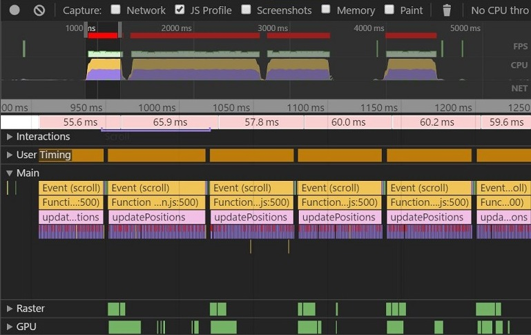
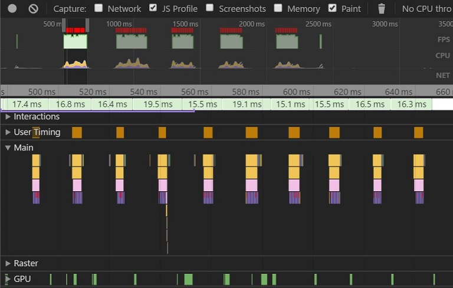

#Website Optimization

##How to run
There are two ways you can open it:

* Click here: [http://yinyuchen.site/projects/P3-WebsitesOptimization/After/index.html](http://yinyuchen.site/projects/P3-WebsitesOptimization/After/index.html) 
* Download the project, then open `index.html`  

##Optimize html
I optimized the page in two steps：  

1. Set `analytics.js` to be asynchronous; 

    ```html
    <script async src="http://www.google-analytics.com/analytics.js"></script>
    ```
2. I set the `style.css` as inline code.

    ```html
    line 12:  <style type="text/css">
    line...:    /* CSS codes */
    line 74:  </style>
    ```
3. Added a media query for 'print.css'

    ```html
    <link href="css/print.css" rel="stylesheet" media="print">
    ```

##Optimize javascript
Optimize `main.js` is kinda complicated, first time I ran the page, I got the following results  
↓  
  

Obviously function `updatePositions()` took a lot of time, so I made some changes inside it:

1. I changed method `querySelectorAll` into `getElementsByClassName`

    ```javascript
    var items = document.querySelectorAll('.mover');
    ```
2. I declare the variable `phase` outside the for-loop

    ```javascript
    for (var i = 0; i < items.length; i++) {
        var phase = Math.sin((document.body.scrollTop / 1250) + (i % 5));
        items[i].style.left = items[i].basicLeft + 100 * phase + 'px';
      }
    ```
3. `transform: translateX()` has better performance, it can reduce the need to trigger a re-layout, so I use `translateX()` instead of `object.style.left`

    ```javascript
    var phase;
      for (var i = 0; i < items.length; i++) {
        phase = Math.sin((document.body.scrollTop / 1250) + (i % 5));
        items[i].style.transform = "translateX("+(items[i].basicLeft + 100 * phase)+"px)";
      }
    ```

4. Then I set property `left` of class `mover` to zero in `views\css\style.css`. In order to only paint the moving pizzas and not the whole screen, I also put `backface-visibility: hidden` in class `mover`, like this:

    ```css
    .mover {
      ...
      left: 0;
      backface-visibility: hidden;
    }
    ```

5. When I change the size of pizzas, it took more than 130ms to resize it! 
   There are so many unnecessary steps in function `resizePizzas()`, I deleted function
  `determineDx()` which is bring a big cost, then I defined `newwidth` out of this for-loop

    ```javascript
    function changePizzaSizes(size) {
        var dx,newwidth;
        for (var i = 0; i < document.getElementsByClassName("randomPizzaContainer").length; i++) {
          dx = determineDx(document.getElementsByClassName("randomPizzaContainer")[i], size);
          newwidth = (document.getElementsByClassName("randomPizzaContainer")[i].offsetWidth + dx) + 'px';
          document.getElementsByClassName("randomPizzaContainer")[i].style.width = newwidth;
    }
    ```
Finally, it cames to ↓

    ```javascript
    function changePizzaSizes(size) {
        var newwidth = (document.querySelector("#randomPizzas").offsetWidth * sizeSwitcher(size)) + 'px';
        for (var i = 0; i < document.getElementsByClassName("randomPizzaContainer").length; i++) {
          document.getElementsByClassName("randomPizzaContainer")[i].style.width = newwidth;
        }
    }
    ```

####After all this optimization, the pizzas cost less than 2ms to resize. <br>And the performance of the page as shown below:
  


